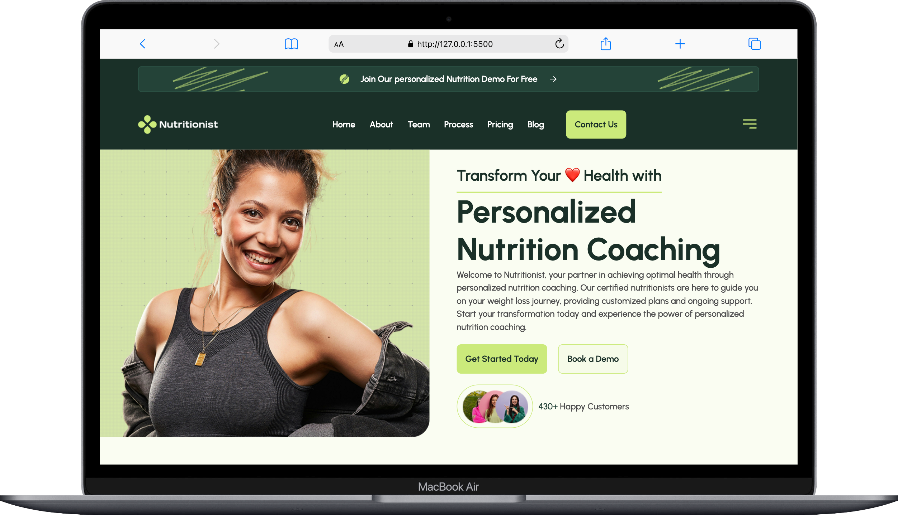
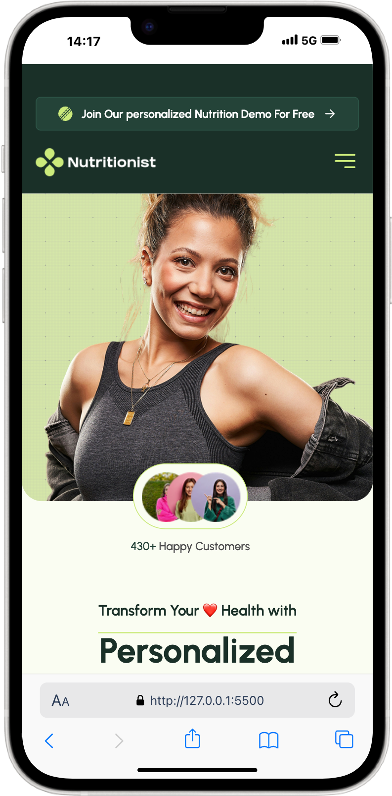

# Project - Personalized Health App 🥗 💪

  


The Personalized Health App is a responsive web application designed for a personalized nutrition coaching service. It features a clean user interface, responsive layouts, and dynamic functionality for an engaging user experience.

This project was developed as part of my 6-month Web Development Bootcamp. While the project was planned for Day 21/22 of the curriculum, I joined the bootcamp late and completed it on my Day 12/13. The aim of the project was to practice the concepts from the first module, particularly HTML and CSS. I had 1 ½ days to replicate a Figma design into HTML, CSS, and JavaScript, showcasing my ability to implement and adapt quickly.

---

## Table of Contents 📑

- [About](#about)
- [Tech Stack](#tech-stack)
- [Getting Started](#getting-started)
  - [Prerequisites](#prerequisites)
  - [Installation](#installation)
- [Design](#design)
- [Deployment](#deployment)

---

## About

The Personalized Health App replicates a provided Figma design to practice core front-end development skills. It includes:

- A responsive navigation menu with a burger menu for smaller screens.
- A hero section with calls-to-action for user engagement.
- Feature cards showcasing app functionalities.
- A calorie requirement calculator implemented with JavaScript.
- Dynamic blog previews and pricing plans with adaptable layouts.

**Note:** Some elements, such as the buttons and the burger menu, are currently non-functional placeholders. The focus of this project was on building the layout and responsive design.

---

## Tech Stack

**Markup:**

- HTML5

**Styling:**

- CSS3

**Interactivity:**

- JavaScript

**IDE:**

- Visual Studio Code

**Version Control:**

- Git & GitHub

**Design Reference:**

- Figma

---

## Getting Started

Follow these steps to set up and run the project locally:

### Prerequisites

Ensure you have the following installed:

- Git
- Visual Studio Code
- Live Server extension for Visual Studio Code

### Installation

1. Clone the repository:

   ```bash
   git clone https://github.com/jutuli/Day21-22-FinalProject-HealthApp.git
   ```

2. Open the project in Visual Studio Code and start the Live Server.

## Design

The design for the Personalized Health App was provided as a Figma file as part of the bootcamp task. My task was to convert this design into a fully functional application using HTML, CSS, and JavaScript. The goal was to match the design closely while ensuring responsiveness across different screen sizes.

## Deployment

The Personalized Health App is deployed using GitHub Pages, making it accessible online. You can access the live version here:
[Link to Project](https://github.com/jutuli/Day21-22-FinalProject-HealthApp)
